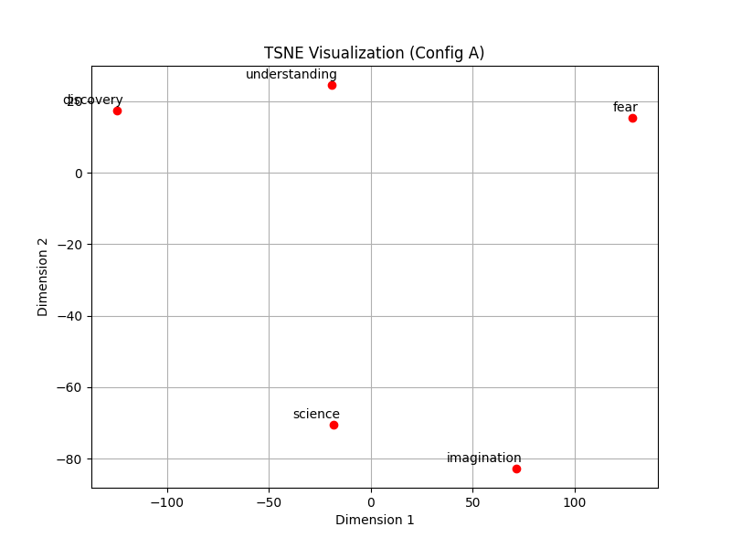
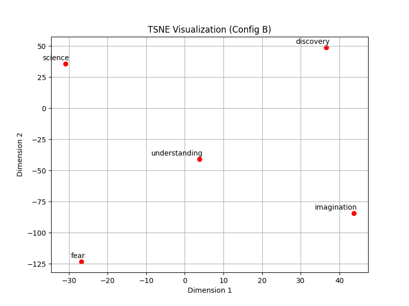
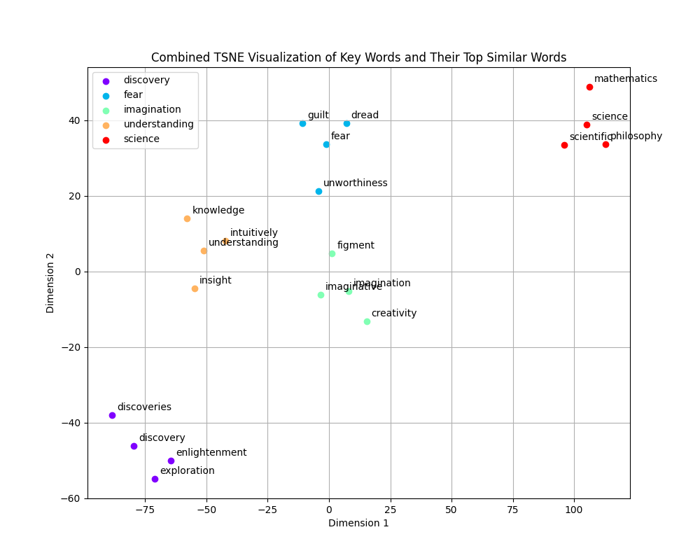
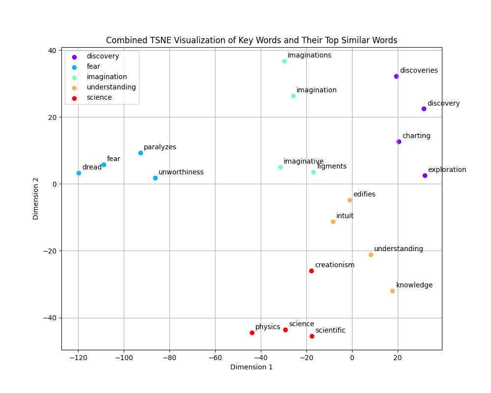
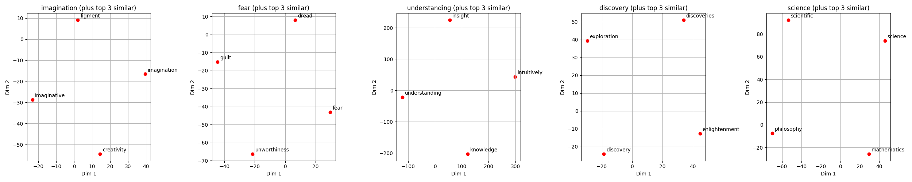
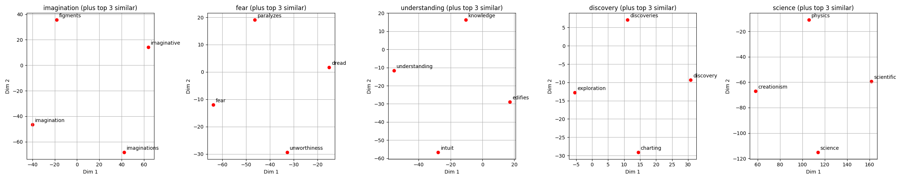

# Part 1: Frequency‑Based Representations and Distributed Word Embeddings

In this project, we performed tasks aimed at understanding and comparing frequency‐based representations (TF‑IDF) and distributed word embeddings (Word2Vec) on a large quotes corpus. The data corpus for this project is downloaded from Kaggle:
[Quotes Dataset](https://www.kaggle.com/datasets/manann/quotes-500k)

The dataset consists of three columns:
	•	quote: The text of the quote.
	•	author: The name of the speaker.
	•	category: The category tags for the quote.
    
## Setup and Execution Instructions

1. Create and activate a Conda environment with Python 3.9:
    ```bash
    conda create -n myenv python=3.9
    conda activate myenv
    ```

2. Install required packages using the requirements file:
    ```bash
    pip install -r requirements.txt
    ```

3. Ensure that the downloaded dataset is in the same directory as main_1.py, then run the main script:
    ```bash
    python main_1.py
    ```

## Tasks Completed

### 1. Preprocessing and Grouping

- Loaded the data and cleaned the author names.
- Preprocessed each quote into tokens by lowercasing, removing punctuation, segmenting (using wordninja with caching), and stopword removal.
- Grouped quotes by author by merging token lists into one document per author.

### 2. Frequency Analysis and TF‑IDF Calculation

- Selected three authors and identified the top 2 frequent words (minimum length of 4 characters).
- Computed custom TF‑IDF scores:
  - **Term Frequency (TF):** (word count / total token count)
  - **Document Frequency (DF):** Number of author documents in which the word appears.
  - **Inverse Document Frequency (IDF):** Using a smoothed formula.
  - **TF‑IDF Score:** TF multiplied by IDF, followed by L2 normalization.

### 3. Distributed Representations with Word2Vec

- Trained two Word2Vec models with different configurations:
  - **Configuration A:** window size = 3, vector dimensions = 50, negative samples = 3.
  - **Configuration B:** window size = 7, vector dimensions = 150, negative samples = 10.
- Compared models by evaluating:
  - Top similar words for the key word “imagination.”
  - Cosine similarity between “fear” and “knowledge.”

### 4. TSNE Visualization

- Produced TSNE visualizations for key words (e.g., “imagination”, “fear”, etc.) for each model.
- Generated additional TSNE plots that visualize for each key word its top 3 similar words.
- Modified plots to save figures using `plt.savefig()` for batch processing.

## Code Techniques

### Preprocessing and Grouping

- **Data Loading:** Pandas is used to load the CSV file.
- **Author Preprocessing:** `preprocess_authors` converts names to lowercase and discards extra data after commas.
- **Text Preprocessing:** `preprocess_text`:
  - Converts text to lowercase.
  - Removes punctuation by replacing it with spaces.
  - Splits text into tokens.
  - Uses wordninja (with caching) for segmentation.
  - Removes stopwords.
- **Grouping:** `group_quotes_by_author` merges tokens for each author into one combined list. We only use tokens and ignore the cleaned_quote field.


### TF‑IDF Computation

**Custom TF‑IDF Implementation**  
The compute_tf_idf function computes:  
- **Term Frequency (TF):** Ratio of each word’s count to the total token count for an author.  
- **Document Frequency (DF):** Number of author documents in which the word appears.  
- **Inverse Document Frequency (IDF):** Using the smoothed formula:

Below is an alternative representation of the IDF formula without using LaTeX block syntax:

    IDF(w) = log((N + 1) / (DF(w) + 1)) + 1

You can include this plain text or code snippet in your markdown.

- **TF‑IDF Score:** Product of TF and IDF, followed by L2 normalization of the document vector.

### Word2Vec and TSNE Visualization

- **Word2Vec Models:** Two configurations are trained with `train_word2vec_model`.
- **Model Comparison:**  
  Compare using top similar words for “imagination” and cosine similarity between “fear” and “knowledge.”
- **Visualization:**
  - `tsne_visualize_embeddings` reduces dimensionality to 2 and plots key word embeddings.
  - `tsne_visualize_similar_groups` retrieves and plots each key word with its top 3 similar words (combined or as subplots).
  - Plots are saved automatically to avoid interactive blocking.

## Findings

### TF‑IDF Analysis

#### Albert Einstein
- Top words: “life” (frequency 56) and “human” (frequency 37).
- TF‑IDF scores are around 0.026 and 0.024, indicating that these words, while frequent, also appear in many documents.

#### Abraham Lincoln
- Top words: “people” (frequency 61) and “shall” (frequency 38).
- TF‑IDF scores are around 0.045 and 0.053, reflecting their lower overall frequency in the corpus (thus higher IDF).

#### Mark Twain
- Top words: “would” (frequency 72) and “good” (frequency 64).
- TF‑IDF scores are around 0.022 and 0.021.

### Word2Vec and TSNE Analysis

#### Model Configurations
Two Word2Vec models were trained with different parameters:
- Configuration A: window=3, size=50, negative=3.
- Configuration B: window=7, size=150, negative=10.

#### Model Comparisons
On “imagination”:

- Configuration A: top similar words include “figment,” “creativity,” and “imaginations” (scores ~0.76–0.78).

    [  
    ('figment', 0.7918354868888855),  
    ('imaginative', 0.7825154066085815),  
    ('imaginations', 0.7786241173744202),  
    ('creativity', 0.7599672079086304),  
    ('fantasy', 0.7462320923805237),  
    ('figments', 0.7369415760040283),  
    ('creative', 0.7139921188354492),  
    ('overactive', 0.711689293384552),  
    ('curiosity', 0.7112140655517578),  
    ('subconscious', 0.705954372882843)  
    ]

- Configuration B: top similar words include “imaginations,” “fantasy,” and “imaginative” (scores ~0.62–0.72).

    [  
    ('imaginations', 0.7175903916358948),  
    ('imaginative', 0.6732912063598633),  
    ('overactive', 0.6428570747375488),  
    ('figments', 0.635586678981781),  
    ('fantasy', 0.630387008190155),  
    ('captivate', 0.6267073154449463),  
    ('whimsy', 0.6245450377464294),  
    ('creativity', 0.6202350854873657),  
    ('figment', 0.6066436171531677),  
    ('mythic', 0.601406455039978)  
    ]

#### Cosine Similarity
- “fear” and “knowledge”: 0.497 (Configuration A), 0.353 (Configuration B). The higher similarity in Configuration A suggests that with a smaller window and lower dimensionality, the model captures a closer local context between “fear” and “knowledge”. Configuration B, with its larger context window and higher dimensions, reflects a broader contextual relationship, resulting in a lower similarity score.

#### TSNE Visualizations
- Clear clustering of “imagination,” “fear,” “understanding,” “discovery,” and “science.”
    - Configuration A:
   
    - Configuration B:
  
- Each key word is plotted with its top 3 similar words, showing distinct clusters in combined views.
    - Configuration A:
  
    - Configuration B:
  
- Individual subplots for each key word and its similar words.
    - Configuration A:
  
    - Configuration B:
  

#### Interpretation

When examining the t-SNE plots, several patterns emerge based on the model configurations:

- **Config A** (smaller window, 50 dimensions, fewer negative samples):
    - Words with similar meanings or that frequently co-occur tend to form tight clusters. For example, "fear" may be located near synonyms such as "dread" or "anxiety".
    - The clusters are generally compact, though the narrow context can occasionally lead to unexpected neighboring words.

- **Config B** (larger window, 150 dimensions, more negative samples):
    - The embeddings reflect more thematic groupings. For instance, "science" might cluster with broader concepts like "philosophy", "mathematics", or "creationism" when they are often discussed together.
    - Increased dimensionality allows words to spread out further, with t-SNE revealing more distinct separations that highlight subtle semantic differences.

**Examples:**

- In Config B, "fear" may align with emotional or psychological terms (e.g., "dread", "guilt", "unworthiness"), capturing its nuanced usage.
- "Imagination" is consistently associated with terms like "creativity", "figment", and "imaginative" in both configurations, though its proximity to other concepts like "science" or "discovery" can vary.
- Config B often shows academic or intellectual terms such as "understanding", "discovery", and "science" clustering together, reflecting contexts related to research and exploration.

**Overall Takeaways:**

- Config B tends to produce embeddings that capture broader topical relationships with more refined semantic distinctions, resulting in stable and clearly separated clusters.
- Config A emphasizes narrower, local co-occurrence relationships by grouping closely related synonyms or immediate collocations, but it may not capture overarching thematic connections as effectively.

## Conclusion

- Preprocessing techniques and grouping allowed for effective document formation per author.
- The custom TF‑IDF implementation produced results consistent with scikit‑learn’s method.
- Word2Vec model configurations meaningfully affect similarity judgments and visualization clusters.
- TSNE plots enhance our understanding of embedding dynamics.

# Part II: Evaluation of Word Meaning Representations

In Part II of this project, we evaluate pretrained word embeddings using both intrinsic and extrinsic evaluation methods. For analogy tests, we assess semantic relationships by examining analogies (e.g., “man is to woman as king is to queen”) and by calculating cosine similarities for word pairs. In addition to established evaluation protocols, we design custom analogy tests to probe limitations in the embeddings, including both domain-specific and adversarial/contrastive benchmarks.

You can download the evaluation dataset, word-test.v1.txt, from the following link: [Mikolov Dataset](https://www.fit.vut.cz/person/imikolov/public/rnnlm/word-test.v1.txt). This dataset is used for further testing and analysis in our embedding evaluation pipeline.

## Setup and Execution Instructions

1. Create and activate a Conda environment with Python 3.9:
    ```bash
    conda create -n myenv python=3.9
    conda activate myenv
    ```
2. Install required packages using the requirements file:
    ```bash
    pip install -r requirements.txt
    ```
3. Ensure that the downloaded dataset is in the same directory as main_2.py, then run the main script:
    ```bash
    python main_2.py
    ```


## Tasks Completed

### 1. Analogy Task

The analogy prediction task is defined as follows: Given a word pair ⟨a, b⟩ and a third word c, predict a fourth word d such that the relationship between a and b mirrors that between c and d. This is achieved by computing the target vector as:

$$
\vec{d} \approx \vec{b} - \vec{a} + \vec{c}
$$

and then selecting the word (excluding a, b, and c) that maximizes the cosine similarity to this vector.

### 2. Antonym Test

A known limitation of word embeddings is that antonyms—despite opposite meanings—often exhibit similar vector representations because they regularly occur in similar contexts. To investigate this, we retrieve the top 10 most similar words for test words (e.g., “increase”, “enter”, “happy”, “hot”, “light”, “big”, “fast”) and analyze whether words with opposite meanings appear among them.

### 3. Custom Analogy Tests

To further challenge the models, we designed two sets of custom analogy questions:

- **Category A: Domain-Specific Analogies**  
    Focused on specific domains such as technology and finance.  
    **Example questions:**
    - (“server”, “data”, “library”, “books”)
    - (“smartphone”, “communication”, “laptop”, “computing”)
    - (“investment”, “risk”, “savings”, “security”)

- **Category B: Adversarial/Contrastive Analogies**  
    Challenging questions that contrast antonymic or unrelated concepts.  
    **Example questions:**
    - (“up”, “down”, “fast”, “slow”)
    - (“light”, “dark”, “high”, “low”)
    - (“big”, “small”, “old”, “young”)

## Methodology

1. **Analogy Dataset:**  
     We use a subset of Mikolov’s analogy dataset (downloaded from here). Only eight groups are used:
     - capital-common-countries
     - currency
     - city-in-state
     - family
     - gram1-adjective-to-adverb
     - gram2-opposite
     - gram3-comparative
     - gram6-nationality-adjective
     
     Groups not in this list (e.g., “capital-world”, “gram4-superlative”, etc.) are skipped.

2. **Pretrained Embeddings:**  
     Two pretrained embedding models were selected:
     - **Model 1:** Word2Vec (Google News 300-dimensional embeddings)
     - **Model 2:** GloVe (Wiki Gigaword 300-dimensional embeddings)

3. **Analogy Test Implementation:**  
     The analogy test is performed using the standard method: for each analogy question (a, b, c, d), we compute the target vector  and then find the word with the highest cosine similarity to that target (excluding a, b, and c).

4. **Antonym Test:**  
     For a list of test words (e.g., “increase”, “enter”, “happy”, “hot”, “light”, “big”, “fast”), the top 10 similar words are retrieved for each model.

5. **Custom Analogy Tests:**  
     Two sets of custom analogy questions were designed:
     
     - **Category A (Domain-Specific):**
         - Example questions:
             - (“server”, “data”, “library”, “books”)
             - (“smartphone”, “communication”, “laptop”, “computing”)
             - (“investment”, “risk”, “savings”, “security”)
     
     - **Category B (Adversarial/Contrastive):**
         - Example questions:
             - (“up”, “down”, “fast”, “slow”)
             - (“light”, “dark”, “high”, “low”)
             - (“big”, “small”, “old”, “young”)

## Findings

### Analogy Test

The Word2Vec model (Model 1) achieved a higher overall accuracy (68.06%) compared to the GloVe model (Model 2, 56.73%) on the analogy test. This suggests that, for the selected analogy tasks, Model 1 better captures the semantic relationships needed to solve the analogies.

#### Model 1 (Google News Word2Vec)

- **Group Accuracies:**
    - **capital-common-countries:** 83.20%
    - **currency:** 35.10%
    - **city-in-state:** 70.90%
    - **family:** 84.58%
    - **gram1-adjective-to-adverb:** 28.53%
    - **gram2-opposite:** 42.73%
    - **gram3-comparative:** 90.84%
    - **gram6-nationality-adjective:** 89.93%
- **Overall Accuracy:** 68.06%

#### Model 2 (GloVe Wiki Gigaword)

- **Group Accuracies:**
    - **capital-common-countries:** 0%
    - **currency:** 0%
    - **city-in-state:** 0%
    - **gram6-nationality-adjective:** 0%
    - **family:** 88.14%
    - **gram1-adjective-to-adverb:** 22.58%
    - **gram2-opposite:** 27.34%
    - **gram3-comparative:** 88.14%
- **Overall Accuracy:** 56.73%

### Antonym Test Results

- **Model 1 (Google News Word2Vec):**
    - increase: The expected antonym “decrease” is returned with a high cosine similarity of 0.8370.
    - enter: Among the similar words, “leave” is present (score 0.4764), which aligns with the expected antonym “exit”.
    - happy: The model returns words like “disappointed” (score 0.6270) that could be interpreted as opposing “happy”, although it doesn’t return “sad” explicitly.
    - hot: The expected antonym “cool” is returned (score 0.5151).
    - light: The expected antonym “dark” is missing; instead, the results include terms related to brightness (e.g., “illumination”, “glow”).
    - big: The model returns words such as “huge” and “bigger” — synonyms rather than the expected antonym “small”.
    - fast: The expected antonym “slow” is returned (score 0.5314).

- **Model 2 (GloVe Wiki Gigaword):**
    - increase: The model returns “decrease” with a similarity of 0.8140, which is correct.
    - enter: Expected antonym “exit” is not found; the similar words are mostly about aspects of entering rather than leaving.
    - happy: The model does not return a clear antonym (like “sad”); it mostly returns synonyms such as “glad” and “pleased”.
    - hot: The expected antonym “cold” is present (score 0.5094).
    - light: The model correctly returns “dark” (score 0.5301).
    - big: The expected antonym “small” is approximated by returning “little” (score 0.5744).
    - fast: The expected antonym “slow” is returned (score 0.6584).

**Interpretation:**
Both models capture some expected antonymic relationships (e.g., “increase” → “decrease”, “hot” → “cool/cold”, “fast” → “slow”). However, they also return several synonyms or related terms instead of clear antonyms for some words. This confirms a well-known limitation of word embeddings: because they are based on distributional similarity (i.e., words appearing in similar contexts), they often fail to distinguish between synonyms and antonyms.

### Custom Analogy Test Results

- **Domain-Specific Analogies:**
    - Both models achieved 0% accuracy on our domain-specific analogies (e.g., technology or finance-related questions), suggesting that neither embedding model captures specialized domain knowledge well.
- **Adversarial/Contrastive Analogies:**
    - **Model 1:** Achieved an accuracy of 66.67%.
    - **Model 2:** Achieved an accuracy of 33.33%.

These custom tests reveal that adversarial questions can expose weaknesses in embeddings, with Model 1 generally performing better on these challenging examples.

## Conclusion

Our evaluation of pretrained word embeddings using analogy and antonym tests revealed several important insights:
- Analogy performance varies by model, with Word2Vec (Google News) generally outperforming GloVe (Wiki Gigaword) on the given tasks.
- Antonym similarity is a known issue, as embeddings tend to capture contextual similarity without differentiating between synonyms and antonyms.
- Custom tests further expose the models’ limitations in handling domain-specific and adversarial analogies.

